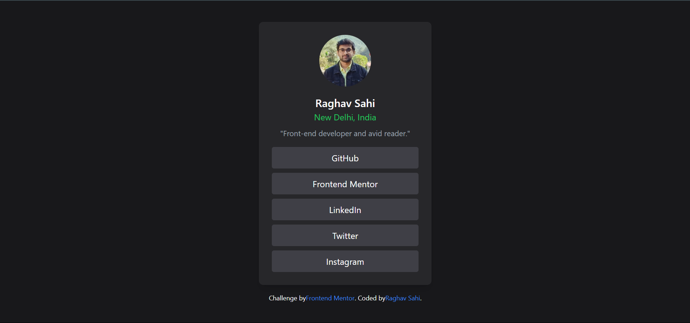

# Frontend Mentor - Social links profile solution

This is a solution to the [Social links profile challenge on Frontend Mentor](https://www.frontendmentor.io/challenges/social-links-profile-UG32l9m6dQ). Frontend Mentor challenges help you improve your coding skills by building realistic projects. 

## Table of contents

- [Overview](#overview)
  - [The challenge](#the-challenge)
  - [Screenshot](#screenshot)
  - [Links](#links)
- [My process](#my-process)
  - [Built with](#built-with)
  - [What I learned](#what-i-learned)
  - [Continued development](#continued-development)
  - [Useful resources](#useful-resources)
- [Author](#author)
- [Acknowledgments](#acknowledgments)

## Overview

### The challenge

Users should be able to:

- See hover and focus states for all interactive elements on the page

### Screenshot

## My process

### Built with

- Semantic HTML5 markup
- Tailwind CSS
- Flexbox

### What I learned

- In this project, I improved my understanding of Tailwind CSS and its utility-first approach. 
- I also gained experience in creating responsive designs using Flexbox.

### Continued development

- I plan to continue focusing on improving my skills in responsive design and exploring more advanced features of Tailwind CSS. 
- Additionally, I aim to deepen my knowledge of JavaScript frameworks such as React.

### Useful resources

- Tailwind CSS Documentation (https://tailwindcss.com/docs/utility-first) - This helped me understand how to use utility-first CSS classes effectively.
- Frontend Mentor (https://www.frontendmentor.io/challenges) - For providing the challenge and improving my front-end skills through realistic projects.

## Author

- Website - [Frontend Mentor | Social links profile](http://127.0.0.1:5501/social-links-profile-main/index.html)
- Frontend Mentor - [@PhoEniX1704](https://www.frontendmentor.io/profile/PhoEniX1704)

## Acknowledgments

This project was inspired by a challenge from Frontend Mentor. Thanks to the community for the feedback and support.
